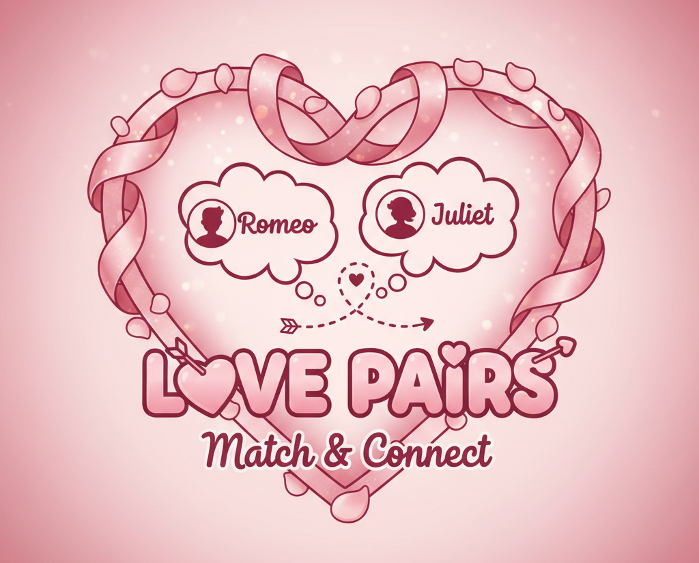
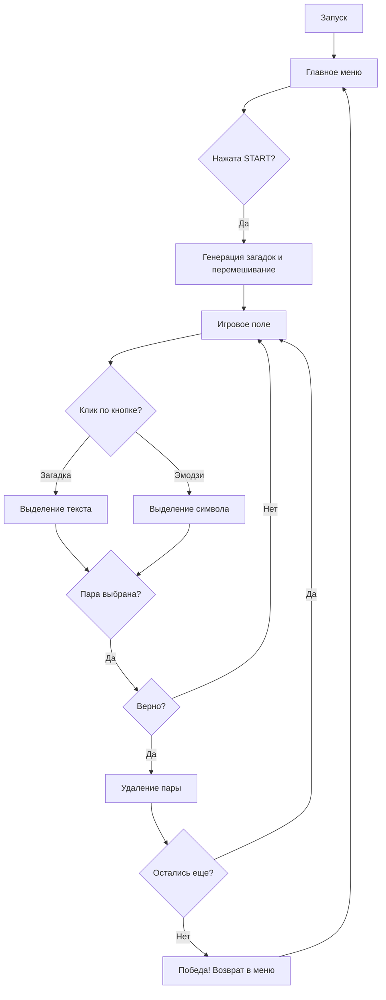

# St. Valentine's Day Matching Game 💘

## Описание проекта
Этот проект представляет собой интерактивную игру-головоломку, посвященную Дню Святого Валентина. Теперь это не просто сопоставление слов, а настоящая викторина с загадками!

## Идея
Пользователю предлагается:
1.  **Загадки в рифму**: На левой панели отображаются карточки с романтическими загадками.
2.  **Эмодзи-символы**: На правой панели находятся соответствующие символы праздника.

**Цель игры**: Разгадать все загадки и сопоставить их с правильными эмодзи.

## Новые возможности
- **Главное меню (Splash Screen)**: Красочная заставка с кнопкой начала игры и тематическим изображением.
- **Рифмованные загадки**: Вместо простых слов теперь используются загадки, что делает процесс интереснее.
- **Улучшенная графика**: Автоматическое масштабирование фонового изображения с сохранением пропорций (больше никаких «расплющенных» картинок!).
- **Навигация**: Кнопка возврата в меню и перезапуск игры после победы.
- **Адаптивный интерфейс**: Увеличенное окно и кнопки для удобного чтения текста.

## Логика игры (Flowchart)

## Технологии
- Python 3.x
- Tkinter (GUI)
- Стандартные библиотеки: `random`, `tkinter.messagebox`

## Как запустить
1. Убедитесь, что у вас установлен Python.
2. Клонируйте репозиторий.
3. Запустите игру: `python game.py`.

